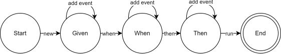

## Given When Then

We previously did an overhaul of our integration tests. In the spirit of knowledge-sharing, here are some of our learnings. Firstly, it is worth noting, that this is not an approach that fits all scenarios. It can, however, be very suitable when you want to do a lot of integration tests on a single system. The setup is based on a Given-When-Then style of representing tests ([martinfowler](https://martinfowler.com/bliki/GivenWhenThen.html)). The TLDR is that you specify a test by a scenario definded using Given-When-Then notation - which is: Given `<some setup>`, when `<some actions>`, then `<some assertions>`. Yes, it is basically Arrange-Act-Assert (AAA). The primary reason for the other terminology, is that this style of testing is originally meant so that _not-so-technical_ people can create tests in the following format: (from [cucumber](https://github.com/cucumber-rs/cucumber))

```
Feature: Eating too much cucumbers may not be good for you

  Scenario: Eating a few isn't a problem
    Given Alice is hungry
    When she eats 3 cucumbers
    Then she is full
```

We decided to remove the layer of parsing free text as we are (🧠*expanding-brain-meme*🧠) clever enough to read function names. What remains is a framework of building blocks based on the interface of the system tested. Tests should be easy to read and write - the building blocks _can be_ as complex as they need be.

Enough introduction, to the fun part. 🚀🚀

## Building the framework

The upfront cost is creating the framework for the tests to run in - In these style of these this is refered to as `World`. We created a statemachine that represent the following diagram:



During `Given` you can add setups to define the initial state of the system. In `When` you define the events that should modify the system. In `Then` you specify the expected conditions of the system.

## World

Shared for all of states, we've decided to defer the execution of the events to the transtion to the next state. In `Given` that is done out of a neccessity, which we will look at shortly. Defered execution in `When` and `Then` is primarily a syntetic sugar to avoid awaiting every function call. In all states, we add events to be exectuted and executes them when we transition out of that state. A generic implementation of `World` can therfore look as follows:

```python
class World:
    def __init__(self, sut = None):
        self.events = []
        self.sut = sut # system under test

    def add_event(self, event):
        self.events.append(event)

    async def execute_events(self):
        for event in self.events:
            await event()

        self.events = []
```

## Given

Given is the first state of our state machine. As mentioned in the previous section, is defering the excution of the events in `Given` neccessary. The reason is that we are during lifetime of `Given` both 1) setting up required parameters of our the system under test (SUT) to run and 2) modifying the state of the system to fit our test. The first part can include everything from connection strings, ports, usernames/passwords to configuration for mocked aspects of the system. In our simple example with cucumbers we have limited these requirements to be which groceries are available. Aside from collecting the required parameters for initialization, we also need to add a hungry Alice to the system before transistioning to the next state.

Our `Given` implementation is thereby:

```python
class Given(World):
    def groceries_available(self, groceries):
        self.groceries_available = groceries
        return self

    def hungry_eater_is_at_table(self, person):
        async def event(person=person):
            await self.sut.set_table(person)
            is_hungry = await self.sut.is_hungry(person)
            assert is_hungry == True

        self.add_event(event)
        return self

    async def when(self):
        self.sut = Application(self.groceries_available)
        await super().execute_events()
        return When(self.sut)
```

Notice how calling `groceries_available` before we call `hungry_eater_is_at_table` could remove the requirement of defering execution of events. However, when defering, we do not need to understand the implementation details of the SUT when writing the test. Additionally, if SUT required other configuration we would not have to change the implementation of `groceries_available`.

### Asserting during setup

We decided to assert the state of the system as we set it up. This is done to ensure that the system we are testing is in fact set up correctly. An example of this is that `hungry_eater_is_at_table` also verifies that a person set at the table will be hungry by defult.

```python
async def event(person=person):
    await self.sut.set_table(person)
    is_hungry = await self.sut.is_hungry(person)
    assert is_hungry == True
```

If this assumption (that a person set at the table is hungry) is incorrect, we would otherwise get unexpected behaivior. First of all, it could crash when forcing a full person to eat. Even worse could be that it succeed because of wrong reasons. In this case that eating does not change the state of whether someone is full or not.

### Wrapping up `Given`

In our test the "Given Alice is hungry" would, given the above, map to:

```python
world = Given()
    .groceries_available(["cucumber"])
    .hungry_eater_is_at_table("Alice")

world = await world.then()
```

## When

Next up is the `When` state. In this we are only interested in executing events. Assumptions on the state of the system before and after are not checked in this state. With our simple test, we only have one thing to do - namely _make Alice eat 3 cucumbers_. Luckily, writing the class is easier than eating those cucumbers:

```python
class When(World):
    def eats(self, person, amount, grocery):
        self.add_event(lambda: self.sut.eat(person, amount, grocery))
        return self

    async def then(self):
        await super().execute_events()
        return Then(self.sut)
```

### Wrapping up `When`

Last thing we did in `Given` was to transition. In `When` we eat the cucumbers and transition:

```python
world = world
    .eats("Alice", 3, "Cucumber")

world = await world.then()
```

Again, `eats` adds futures to an internal state, which are then executed in `then`. With this simple test, one could argure that `eats` should be async instead of `then`. This would produce a better stacktrace if `eats` would fail. An argument against this is that each additional event in `Then` would also need to be awaited. In the end this boils down to a tradeoff between tracability when a test fails versus the readability and writability of it.

## Then

Now, we must set up our assertions. Everything we can monitor from outside the system, can go into here. With our given test, we can check if Alice is still hungry. We can also check (if the API allows it) if she is still seated. Maybe, we can check if an event has occured, that she said "thank you". It can be difficult to make assertions easily, as they might require us to percieve the result of an endpoint. It could be that the only GET endpoint of the solution is `/table` and we have to iterate over everyone seated to find Alice and then check if she is full. The important thing is that all if this is implementation details of `is_full` in `Then`. In this case, the SUT has an endpoint of the same name, and the implementation of `Then` is thereby:

```python
class Then(World):
    def is_full(self, person):
        self.add_event(lambda: self.sut.is_full(person))
        return self

    async def run():
        await super().execute_events()
```

### Wrapping up `Then`

Similaly to above, we transitioned so we add our event(s) and then execute the assertions:

```python
world = world
    .is_full("Alice")

await world.run()
```

## Testing

Assembling all the pieces from the above yields the following test:

```python
async def test_eating_a_few_is_not_a_problem():
    given = Given().groceries_available({"cucumber"}).hungry_eater_is_at_table("Alice")
    when = (await given.when()).eats("Alice", 3, "cucumber")
    then = (await when.then()).is_full("Alice")
    await then.run()
```

The benefit of this framework is not that _this_ test has been easy to make. One benefit is that it is very easy to read what the test is doing. If we add a feature to the system, that you can eat another cucumber if you wait 10 minutes, then we can easily add a function to `When` called `minutes_passes(minutes)` and make another test as:

```python
def test_after_10_minutes_you_can_eat_again():
    ...
    when.eats("Alice", 3, "cucumber").minutes_passes(10).eats("Alice", 1, "cucumber")
    ...
```

or that there is always room for icecream:

```python
def test_there_is_always_room_for_icecream():
...
when.eats("Alice", 3, "cucumber").eats("Alice", 1, "icecream")
...
```

## Final Thoughts

### Downside

In the icecream example, it would be nice to be able to assert that Alice is, in fact, full after eating 3 cucumbers. There are multiple solutions to this.

**Duplication**: One is to have both tests, but that is code duplication, which is usually not a good thing.

**Events**: Another solution is if some other events are available that indicates the same. It might be an event saying "Alice is full" followed by another event "Alice eats icecream". In this case, it is obvious that Alice ate icecream despite being full. This do puts some extra requirements on the system and the requirements about the events might not be related to the feature tested.

**Redesign states**: Finally, one could also consider if `When` and `Then` states are in fact different. The implementation of `When.then()` and `Then.run()` are both just executing the events, with the former also transistioning. One could therefore either 1) merge the two states into one, or 2) allow transitioning back from `Then` to `When`, for the few cases where assertions during the test are required.

### Improving the framework

Wrapping expressions in await is cucumbersome so one _could_ add a helper method in `World`:

```python
def run(given, when, then):
    async def inner(given, when, then):
        given = given(Given())
        when = when(await given.when())
        then = then(await when.then())

    import asyncio
    asyncio.run(inner(given, when, then))
```

This would allow us to provide lamdas for each state and not having to be concered with await/async.

The test would now instead be:

```python
def test_eating_a_few_is_not_a_problem():
    given = lambda given: given.groceries_available({"cucumber"}).hungry_eater_is_at_table("Alice")
    when = lambda when: when.eats("Alice", 3, "cucumber")
    then = lambda then: then.is_full("Alice")
    World.run(given, when, then)
```
