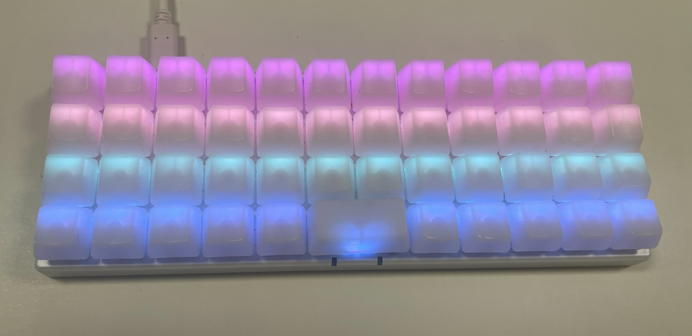
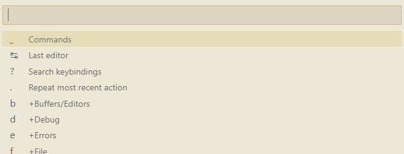
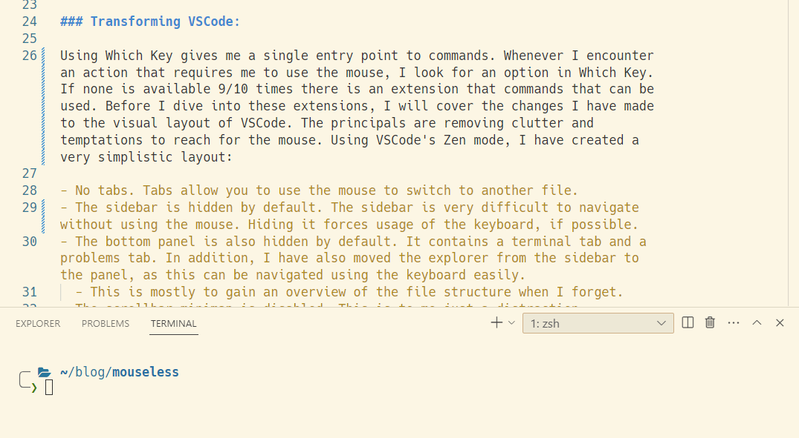

# A Journey to Seamless Keyboard Usage

A year ago, during one of my late-night YouTube marathons, I stumbled upon [a review](https://www.youtube.com/watch?v=NcnMR8D0G5o&ab_channel=BenVallack) of the ortholinear [Planck keyboard](https://blog.zsa.io/2307-goodbye-planck-ez/). I was intrigued. My first thought was that it couldn't be pragmatic to use only 47 keys. Most of my work is in front of a keyboard, so after watching a few videos about the keyboard and the reasoning behind ortholinear, I decided to give it a try. Initially, it was meant to be a fun experiment, and I felt there was a 50/50 chance of me being happy with the decision. I ended up being obsessed with optimizing every part of the experience. I have heard how good typists forget they're using a keyboard, as their thoughts magically appear on the screen without them thinking about how to type them. Myself, on the other hand, have always been terrible at using a keyboard. The main reason was that I didn't know how to touch type. Instead, I would use 5 or 6 fingers and constantly readjust my hands. In this post, I'll describe my journey of improving many aspects of how I use a keyboard. I still type slower than many of my colleagues, but I've learned something I never thought I would: I can now type without thinking about it.

## The Shift to Planck Keyboard:

The Planck is a minimalistic, 4-row, 37-key ortholinear layered keyboard. "Ortholinear" means that the keys are placed in a grid instead of the traditional staggered layout, where keys are offset going up and down. This keyboard is layered, meaning you can access other symbols by switching layers. This is similar to the keyboard on a smartphone, where symbols have an entirely separate layer. What these layers do is up to you to decide.



When I started using the keyboard, I wasn't expecting the amount of customizing I'd be doing. I began by trying alternatives to the traditional QWERTY layout and experimented with where to put arrow keys, F-keys, and symbols. Every time I made a change, I had to relearn the keyboard from scratch. The keyboard arrived with symbols for letters and modifiers, etc., but no visual aid is available for other keys. Instead, I had to keep a window open on my computer to display where keys were located. There were days where I was about to quit, but my stubbornness and pride wouldn't allow me to.

With persistence, I eventually found inspiration in Vim for navigation. It began with just the HJKL keys as arrow keys on another layer. Later came other Vim commands like W and B for jumping words, and later even more commands. This was a huge relief. Having used Vim for minor file changes, I was already familiar with the basic navigation. This meant I just had to get used to changing layers instead of entering and exiting text mode. Programmable keyboards can distinguish between holding down a key and tapping it. My F and J keys are set to switch to the Vim navigation layer when held. It takes practice to always tap when typing, but eventually, it becomes easy to distinguish between typing a letter and changing a layer. Similarly, I can enter a visual layer by holding down V or a deletion layer by holding down D. I won't go into all the details of the keyboard layout, but the basic concept is that I rarely have to make key combinations of more than two keys - one for changing a layer and another to select something in that layer. That in itself is something stock keyboards with twice the number of keys fail to achieve.

## One Step Further

The setup I now have allows my wrists to barely touch the table in front of the keyboard, while my fingers doing most of the work. I've bought keycaps without symbols, as I no longer need the visual aid. I type faster and more consistently and feel that I can focus more on the task at hand and less on the task of the hands.

However, something more had to be done. I was still reaching for my mouse to do many non-typing related tasks while writing. Open this file, check that thing, do this, do that... Using the mouse is a big setback of all the other advancements. I primarily use VSCode as my IDE. I like that it's lightweight and offers all the extensions and customizability you could imagine. The next step in my journey has been to make VSCode as lean and minimalistic as the keyboard.

Out of the box, VSCode comes with a lot of keybindings. When used, you don't have to touch the mouse at all. Everything is accounted for - except how to learn them. The problem, to me, is twofold; firstly, there's no good way to memorize these. Every time you need to learn a keybinding, you basically have to search for it. There's no feedback to help you gradually learn. Secondly, they are complex, conditional, unintuitive, and unhandy.

WhichKey has solved both sides of this issue in many editors and luckily also in VSCode.
The WhichKey extension provides a common entry point for commands. The entry point is very similar to opening the command window with `Ctrl+Shift+P`. The difference is how commands are available within the command window. With the original solution, you must search for the command in free text. With WhichKey, you instead get a menu.



This menu is divided into sections for types of tasks. An example from my configuration could be `C+f+f` (`C` being the WhichKey trigger), which lets you search for a file and open it. This is similar to `Ctrl+p`. At first glance, this seems to be an additional key press to do the same. However, the first `f` opens all file-related commands. From here, you can also create a new file, rename a file, etc. `C+tab` goes to the previously opened document, `C+x` opens all text-related commands. Having keybindings grouped together it all coherent. All of this is, of course, customizable, and if you forget a keybinding, you can press `C+?`, which allows you to search for it and its command. The idea is to have a single entry for all keybindings.

### Transforming VSCode:

WhichKey provides a single entry point to commands. Whenever I encounter an action that requires me to use the mouse, I look for an option in WhichKey. If none is available, 9 times out of 10 there's an extension that provides the needed commands. These extensions allow me to hide most of the default interface, as I don't need to click on them. Before I dive into the extensions, I'll cover the changes I've made to the visual layout itself. The principle is simple - remove the clutter. Using VSCode's Zen mode, I now have a very simplistic layout:

- No tabs.
- The sidebar is hidden by default. The sidebar is difficult to navigate without using the mouse. Hiding it forces usage of the keyboard, if possible.
- The bottom panel is also hidden by default. It contains a terminal tab and a problems tab. In addition, I've moved the explorer from the sidebar to the panel, as this can be navigated using the keyboard easily.
  - This is mostly to gain an overview of the file structure when I forget.
- The scrollbar minimap is disabled. This is just a distraction to me.

The visual settings to configure Zen mode are:

```
"zenMode.hideLineNumbers": false,
"zenMode.showTabs": "none",
"zenMode.hideStatusBar": true,
"zenMode.hideActivityBar": true,
"zenMode.restore": false,
"zenMode.fullScreen": true,
"zenMode.centerLayout": false,
"zenMode.silentNotifications": false,
"editor.minimap.enabled": false,
"workbench.statusBar.visible": false,
```

All of the above results in just the current code file being visible when I'm actually coding. I have easily accessible commands through WhichKey to open the terminal, explorer, and problems tabs too. Below is a screenshot of what's visible 99% of the time.



All of this has allowed me to rotate my primary screen, as I no longer need the width. Text is at 125% to make reading a bit easier while still being able to easily have more than 80 characters per line.

### Extensions

- [WhichKey](https://marketplace.visualstudio.com/items?itemName=VSpaceCode.whichkey) - the enabler.
- [VSpaceCode](https://marketplace.visualstudio.com/items?itemName=VSpaceCode.vspacecode) - Spacemacs-like bindings for Which Key - A nice starting point.
- [Advanced New File](https://marketplace.visualstudio.com/items?itemName=patbenatar.advanced-new-file) - Create a new file in a location (instead of creating a new untitled one).
- [Better Search](https://marketplace.visualstudio.com/items?itemName=travisthieman.better-search) - Search in the solution. Results open as an editor with links to the results. This removes most of the needs for the search sidebar.
- [Fuzzy Search](https://marketplace.visualstudio.com/items?itemName=jacobdufault.fuzzy-search) - Fuzzy search in the active file.
- [File Browser](https://marketplace.visualstudio.com/items?itemName=bodil.file-browser) - Keyboard-driven file browser.

### Git

Although I've used git CLI for most of my git commands, there are some tasks that are simply too annoying to do using the CLI. Recently, I've given [lazygit](https://github.com/jesseduffield/lazygit) a fair chance, and I must admit, it's awesome. It's a full-blown git interface in the terminal. It's keyboard-driven and provides an awesome way to partially stage files, resolve merge conflicts, and almost everything else you'd ever need. This was the final roadblock I needed to remove in order to be truly mouseless when coding.

### VSCode Vim

A cheaper alternative to buying an expensive programmable keyboard is to use VSCode's Vim extension (many other IDEs also have this available). It provides all the functionality from Vim, but only from within the editor, of course. I've used it before getting the keyboard and consider giving it a try with the keyboard. There are some limitations that cannot be handled with the keyboard, as it doesn't have the context of the file. Things like jumping to a line or marking a scope are not possible. Currently, I have commands for those things in WhichKey instead.

## Conclusion

Adopting this setup wasn't without its challenges. The initial weeks (and months) with the new keyboard were riddled with typos and slow typing speeds as my fingers adjusted to the new layout. Customizing the keyboard and VSCode was a task of trial and error, balancing functionality with simplicity. But with each passing day, muscle memory kicked in, and the advantages began to outweigh the initial discomfort.

This journey has been more than just about efficiency; it's been a journey of learning and personalization. I strongly recommend others consider if they're satisfied with the level of attention they have to put into their writing. It's not about a keyboard, a setup, or extensions. When we sit in our car, we don't think about how to turn or brake. That's something we do on autopilot, which allows us to focus our attention on other aspects. I think that's equally important when we sit at the desk.

And to answer your question: No, I will never get back the hours I've spent customizing my IDE or keyboard. If I had just done my job instead, productivity would have been much higher - but where's the fun in that?
